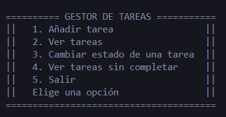

# Gestor de Tareas

Aplicación de consola desarrollada en C# que permite gestionar una lista de tareas. El proyecto permite crear, consultar y actualizar tareas, así como almacenarlas en un archivo JSON para conservar la información entre ejecuciones.

## Autor

- [@LauraCalvo00](https://www.github.com/LauraCalvo00)

## Funcionalidades
 - Añadir tareas. 
 - Cambiar el estado de una tarea (pendiente/completada).
 - Mostrar todas las tareas. 
 - Mostrar únicamente las tareas pendientes. 
 - Guardar automáticamente las tareas en un archivo JSON.
 - Cargar las tareas desde un archivo JSON al iniciar la aplicación.

## Conceptos practicados
- Clases y objetos.
- Métodos.
- Listas (List<T>).
- Estructuras de control (if, switch, foreach, do-while).
- Validación de entradas con TryParse().
- Serialización y deserialización de datos con System.Text.Json.
- Lectura y escritura de archivos.
- Organización del código en diferentes clases y responsabilidades.

## Tecnologías utilizadas

 - C#
 - .NET
 - System.Text.Json
 - Git , Github

## Captura de pantalla del menú

Próximas mejoras
    Eliminar tareas.
    Editar una tarea.
    Añadir prioridades.
    Añadir fechas límite.
    Mejorar la interfaz de la aplicación de consola.
